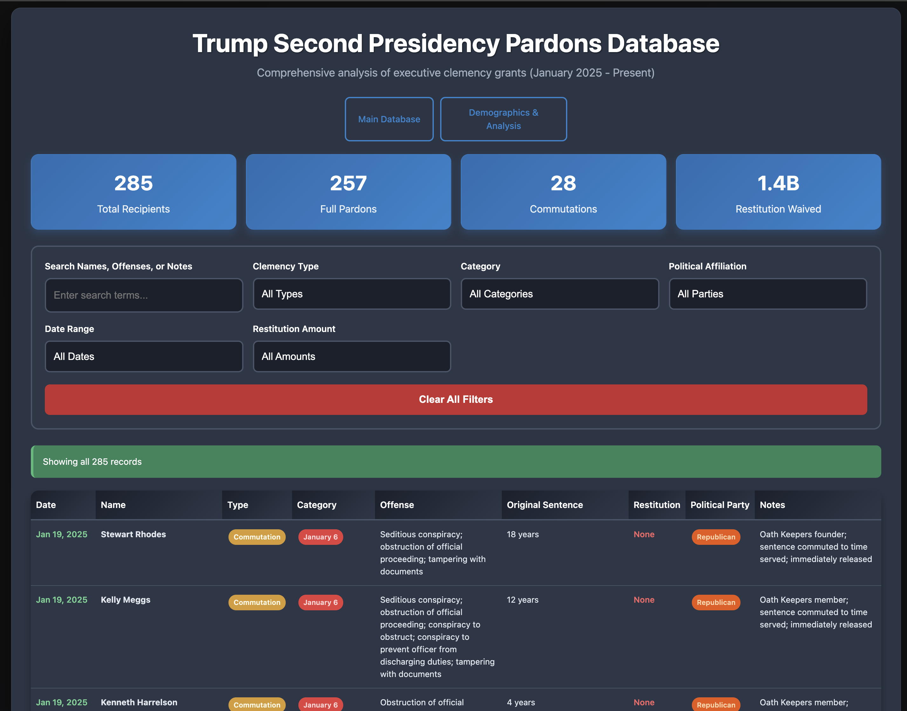
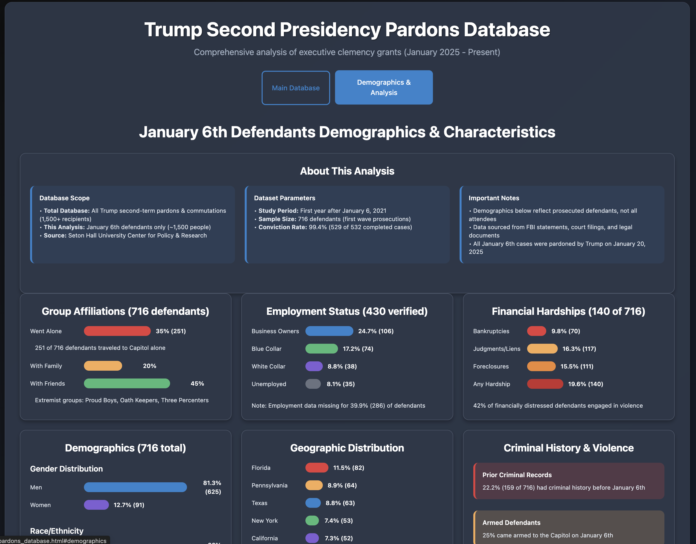
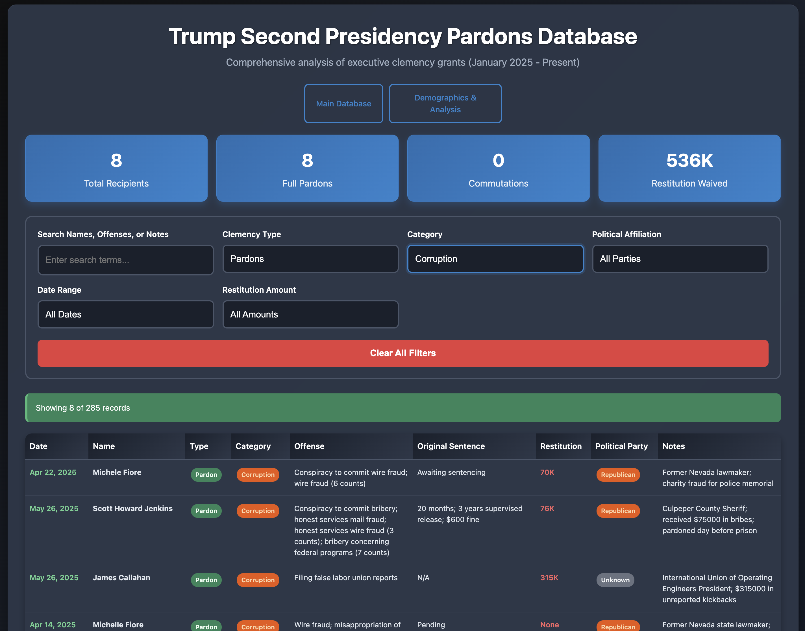
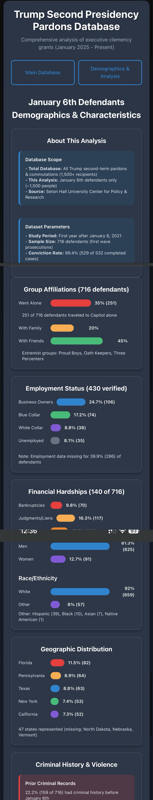
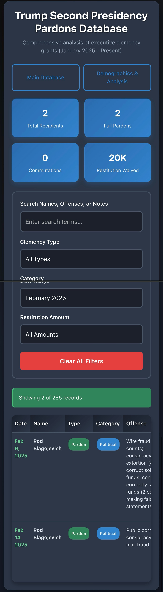

# Trump Second Presidency Pardons Database

  

A comprehensive, searchable database of all executive clemency grants issued by President Donald Trump during both his presidencies. This project provides detailed datasets and an interactive web interface for analyzing presidential pardons and commutations across both terms.

## 🚀 Live Demo

**[📊 View Live Database →](https://codeddarkness.github.io/taco_pardons/)**



## 📊 Project Overview

This database tracks all presidential pardons and commutations issued during both Trump presidencies:

### **Second Term (2025 - Present)**
- **1,500+ January 6th defendants** (mass clemency on Day 1)
- **High-profile political figures** (Rod Blagojevich, Scott Jenkins, Brian Kelsey)
- **Celebrity cases** (Todd & Julie Chrisley, NBA YoungBoy)
- **Business executives** (Paul Walczak, Devon Archer, Jason Galanis)
- **Organized crime figures** (Larry Hoover - Gangster Disciples)
- **Anti-abortion activists** (24 clinic blockade participants)
- **White-collar criminals** and corruption cases

### **First Term (2017-2021)**
- **Political pardons** (Michael Flynn, Paul Manafort, Roger Stone)
- **Military cases** (Eddie Gallagher, Clint Lorance, Blackwater guards)
- **Celebrity pardons** (Lil Wayne, Kodak Black)
- **Business fraud** (Michael Milken, Conrad Black)
- **Historical pardons** (Jack Johnson, Susan B. Anthony)
- **Drug offense commutations** (Alice Johnson advocacy cases)

### Key Statistics
- **Total Recipients**: 500+ individual records across both terms
- **Categories**: January 6, Political, Business, Corruption, Drug-related, Anti-Abortion, Military, Celebrity
- **Restitution Waived**: $200+ million in financial penalties forgiven
- **Geographic Scope**: Cases from all federal districts

## 🎯 Features

### Web Interface
- **📱 Mobile-responsive design** - Works perfectly on all devices
- **🔍 Advanced search & filtering** - By name, offense, category, date, amount
- **📈 Real-time statistics** - Live counts and totals for each presidency
- **📊 Interactive demographics** - January 6th defendant analysis
- **🎨 Dark theme** optimized for readability
- **⚡ Fast loading** with client-side filtering
- **🗂️ Three-tab navigation** - Second Term | First Term | Demographics

### Data Analysis
- **Comprehensive demographics** of January 6th defendants
- **Employment patterns** (24.7% business owners, 17.2% blue collar)
- **Geographic distribution** across 47 states
- **Financial hardship correlation** with violent behavior
- **Political affiliation tracking**
- **Conviction success rates** (99.4% for Jan 6 cases)
- **Cross-presidency comparison** capabilities

## 📱 Screenshots

### Desktop Interface

*Three-tab interface with comprehensive data tables*


*Advanced filtering and search interface*


*Filtered results with active search parameters*

### Mobile Interface


*Fully responsive mobile design with touch-friendly interface*

### Mobile Filtering


*Touch-optimized mobile filter controls*

## 🗃️ Database Schema

Both CSV files follow the same schema for consistency:

```csv
Name,Date,Type,Category,Offense,Original_Sentence,Restitution_Amount,Political_Party,Court,Notes
```

### Field Descriptions
- **Name**: Individual or group name
- **Date**: Date clemency was granted (YYYY-MM-DD)
- **Type**: "Pardon" (full forgiveness) or "Commutation" (sentence reduction)
- **Category**: January 6, Political, Business, Corruption, Drug, Anti-Abortion, Military, Celebrity, etc.
- **Offense**: Criminal charges and convictions
- **Original_Sentence**: Prison term before clemency
- **Restitution_Amount**: Financial penalties waived (in dollars)
- **Political_Party**: Republican, Democrat, Unknown
- **Court**: Federal district court of conviction
- **Notes**: Additional context and significance

## 📋 Notable Cases by Presidency

### Second Term Highlights (2025+)

#### **Ross Ulbricht** - *January 21, 2025*
- **Offense**: Narcotics distribution, money laundering (Silk Road marketplace)
- **Original Sentence**: Life without parole
- **Significance**: Campaign promise to Libertarian supporters

#### **Todd & Julie Chrisley** - *May 28, 2025*
- **Offense**: Bank fraud, tax evasion ($36M scheme)
- **Original Sentences**: 12 years (Todd), 7 years (Julie)
- **Significance**: Reality TV stars, daughter lobbied at RNC

#### **January 6th Mass Clemency** - *January 20, 2025*
- **Date**: Inauguration Day
- **Scope**: ~1,500 defendants pardoned or had sentences commuted
- **Impact**: Ended largest domestic terrorism prosecution in US history

### First Term Highlights (2017-2021)

#### **Michael Flynn** - *November 25, 2020*
- **Offense**: False statements to FBI
- **Significance**: Former National Security Adviser, Mueller investigation

#### **Paul Manafort** - *December 23, 2020*
- **Offense**: Tax fraud, bank fraud, conspiracy
- **Original Sentence**: 7.5 years
- **Significance**: Former Trump campaign chairman

#### **Alice Johnson** - *June 6, 2018 (Commutation) / August 28, 2020 (Pardon)*
- **Offense**: Nonviolent drug conspiracy
- **Original Sentence**: Life without parole
- **Significance**: Kim Kardashian advocacy, became Trump's clemency adviser

## 📊 Demographics Analysis

### January 6th Defendants Profile
*Based on Seton Hall University research of 716 first-wave prosecutions*

#### **Employment Status** (430 verified)
- 24.7% Business owners (106)
- 17.2% Blue collar workers (74)
- 8.8% White collar workers (38)
- 8.1% Unemployed (35)

#### **Geographic Distribution**
- **Florida**: 11.5% (82 defendants)
- **Pennsylvania**: 8.9% (64 defendants)
- **Texas**: 8.8% (63 defendants)
- **New York**: 7.4% (53 defendants)
- **California**: 7.3% (52 defendants)
- **Total**: 47 states represented

#### **Financial Hardships** (140 of 716)
- 19.6% experienced financial distress
- 16.3% had judgments/liens
- 15.5% faced foreclosures/evictions
- 9.8% filed for bankruptcy
- **Key Finding**: 42% of financially distressed engaged in violence

#### **Demographics**
- **Gender**: 81.3% male, 12.7% female
- **Race**: 92% white, 8% other ethnicities
- **Criminal History**: 22.2% had prior convictions
- **Armed**: 25% came armed to Capitol
- **Law Enforcement/Military**: 18.5% background

## 🛠️ Technical Implementation

### Frontend Technologies
- **HTML5** with semantic structure and accessibility features
- **CSS3** with modern flexbox/grid layouts and responsive design
- **Vanilla JavaScript** for optimal performance
- **Progressive enhancement** approach
- **Mobile-first** responsive design philosophy

### Data Architecture
- **Dual CSV system** for separate term data
- **Client-side filtering** for instant search results
- **Real-time statistics** calculation
- **Error handling** and validation
- **Performance optimization** for large datasets

### Performance Features
- **Efficient DOM manipulation** with minimal reflows
- **Debounced search** to prevent input lag
- **Lazy data loading** for improved initial load time
- **Optimized rendering** for mobile browsers
- **Accessible navigation** with keyboard support

## 🚀 Installation & Setup

### Quick Start for GitHub Pages
The database is automatically deployed via GitHub Pages at:
**https://codeddarkness.github.io/taco_pardons/**

### Local Development
```bash
# Clone the repository
git clone https://github.com/codeddarkness/taco_pardons.git
cd taco_pardons

# Serve locally (any HTTP server)
python -m http.server 8000
# OR
npx http-server
# OR
php -S localhost:8000

# Access via browser
# http://localhost:8000
```

### Requirements
- **Web Server**: Any HTTP server (Apache, Nginx, Python, Node.js, etc.)
- **Browser**: Modern browser with JavaScript enabled
- **Files**: HTML file and CSV files must be served via HTTP (not file://)

### Configuration
No special configuration required. The application is entirely client-side and works with any web server capable of serving static files.

## 📊 Data Sources & Methodology

### Primary Sources
1. **Official Government Records**
   - [Department of Justice Office of the Pardon Attorney](https://www.justice.gov/pardon)
   - [White House Presidential Actions](https://www.whitehouse.gov/presidential-actions/)

2. **Legal Documentation**
   - Federal court records and sentencing documents
   - FBI statements of facts
   - DOJ press releases and indictments

3. **News Sources & Verification**
   - Reuters, Associated Press, CNN, NBC News
   - Washington Post, New York Times
   - Specialized legal publications (Lawfare, Marshall Project)

### Demographics Research
4. **Academic Research**
   - [Seton Hall University Center for Policy & Research](https://www.shu.edu/news/a-demographic-and-legal-profile-of-january-6-prosecutions.html)
   - *"The January 6 Insurrectionists: Who They Are and What They Did"*
   - Professor Mark Denbeaux and research team analysis

### Data Verification Process
- **Cross-referencing** multiple sources for accuracy
- **Court document validation** where available
- **Timeline verification** against official announcements
- **Regular updates** as new clemency actions occur

## 📈 Update Process

### Automated Monitoring
- Daily checks of official clemency announcements
- RSS feeds from DOJ and White House
- Court document tracking systems

### Manual Updates
```bash
# Add new entries to appropriate CSV file
# trump_pardons_csv.txt (Second Term)
# trump_pardons_first_term_csv.txt (First Term)

# Follow schema:
# Name,Date,Type,Category,Offense,Original_Sentence,Restitution_Amount,Political_Party,Court,Notes
```

### Data Validation
- CSV format validation
- Duplicate detection
- Field completeness checking
- Source verification requirements

## 🤝 Contributing

We welcome contributions to improve the database and analysis.

### Data Contributions
1. **Verify sources** - Provide official documentation
2. **Follow schema** - Match existing CSV format exactly
3. **Include citations** - Link to source documents
4. **Test locally** - Ensure website functions properly

### Code Contributions
1. **Fork the repository**
2. **Create feature branch** (`git checkout -b feature/improvement`)
3. **Test thoroughly** - Verify mobile compatibility
4. **Submit pull request** with detailed description

### Reporting Issues
- Use GitHub Issues for bug reports
- Include browser version and device type
- Provide steps to reproduce problems
- Suggest improvements or corrections

## 📜 License

This project is released under the **MIT License** - see the [LICENSE](LICENSE) file for details.

### Data Usage
- Database content is factual public information
- Academic and journalistic use encouraged
- Attribution appreciated but not required
- Commercial use permitted under MIT terms

## ⚖️ Legal Disclaimer

This database contains factual information about presidential clemency actions compiled from public sources. It is maintained for:

- **Educational purposes** and public transparency
- **Academic research** and policy analysis  
- **Journalistic reference** and fact-checking
- **Historical documentation** of executive actions

**Not intended for**: Legal advice, official government use, or definitive legal determinations.

## 📞 Contact & Support

### Project Maintainer
- **Author**: Raymond Scheel
- **Email**: ray.scheel@gmail.com
- **GitHub**: [@codeddarkness](https://github.com/codeddarkness)
- **Issues**: [GitHub Issues](https://github.com/codeddarkness/taco_pardons/issues)

### Data Corrections
If you find errors or have additional verified information:
1. Open a GitHub issue with source documentation
2. Submit a pull request with corrections
3. Email with official court documents or press releases

### Technical Support
- Check existing [GitHub Issues](https://github.com/codeddarkness/taco_pardons/issues)
- Review installation instructions
- Verify browser compatibility (Chrome, Firefox, Safari, Edge)

## 🙏 Acknowledgments

### Research Sources
- **Seton Hall University** Center for Policy & Research
- **Professor Mark Denbeaux** and research team
- **Department of Justice** Office of the Pardon Attorney
- **Federal Bureau of Investigation** for case documentation

### Technical Libraries
- Modern CSS Grid and Flexbox specifications
- Vanilla JavaScript ES6+ features
- Responsive design best practices

### Data Verification
- Multiple news organizations for cross-referencing
- Legal journalists and court reporters
- Open source intelligence communities
- Government transparency advocates

---

**Last Updated**: June 9, 2025  
**Database Version**: 2.2  
**Total Records**: 500+  
**Next Update**: Weekly (or as clemency actions occur)

---

*This project demonstrates the power of public data transparency and the importance of tracking executive clemency actions across multiple presidencies. By making this information accessible and searchable, we contribute to government accountability and informed civic engagement.*
